# 图像超分辨率（Image Super Resolution）
## 使用 Visual Studio Tools for AI 加速深度学习案例开发

## 一、业务背景
本实验将使用时深度学习技术对图像进行超分辨率重建，设计到的技术包括了卷积神经网络，生成对抗网络，残差网络等。

## 二、开发环境
本实验使用到“Microsoft Visual Studio”、“VS Tools for AI”等开发组件，涉及到了“TensorFlow”、“NumPy”、“scipy. misc”、“PIL.image”等框架和库，其中“scipy. misc”与“PIL.image”用于图像处理。本实验还需要“NVIDIA GPU”驱动、“CUDA”和“cuDNN”等。

详细的环境配置方法见“VS Tools for AI”的[官方文档](https://github.com/Microsoft/vs-tools-for-ai/blob/master/docs/zh-hans/docs/prepare-localmachine.md)。

配置好环境后，进入“Microsoft Visual Studio”，本实验使用的是2017版本。点击“文件”、“新建”、“项目”，然后在“AI工具”中选择“通用Python应用程序”，项目名称设置为“image-super-resolution”，点击“确认”即可创建项目。

后续双击“image-super-resolution.sln”即可进入项目。

## 三、数据探索
本实验的数据可以选择CV领域各类常见的数据集，实验将以CelebA数据集作为示例。CelebA是香港中文大学开放的人脸识别数据，包括了10177个名人的202599张图片，并有5个位置标记和40个属性标记，可以作为人脸检测、人脸属性识别、人脸位置定位等任务的数据集。数据集可在[Google Drive](https://drive.google.com/drive/folders/0B7EVK8r0v71pTUZsaXdaSnZBZzg)中下载，详细信息可在[官方网站](http://mmlab.ie.cuhk.edu.hk/projects/CelebA.html)中查看。本实验使用该数据集中`img_align_celeba.zip`这一文件，选择了其中前10661张图片，每张图片根据人像双眼的位置调整为了219x178的尺寸。解压后的图片如图1所示。

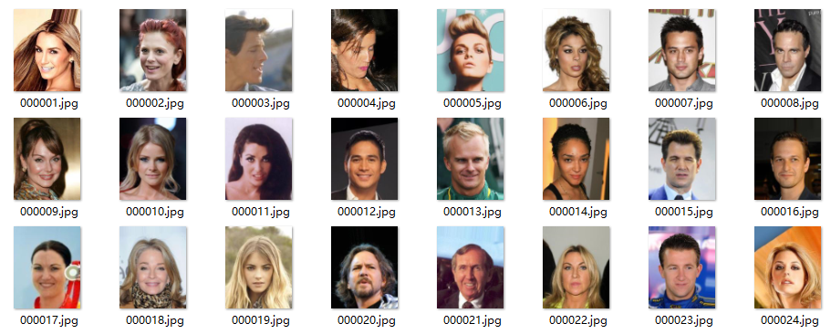


本实验需要得到图1中图像的低分辨率图像，并通过深度学习将这些低分辨率图像提升到高分辨率图像，最后与图1中的原图进行对比查看模型的效果。


在图像超分辨率问题中，理论上可以选择任意的图像数据，当时根据经验，使用有更多细节纹理的图像会有更好的效果，使用无损压缩格式的PNG格式图像比JPG格式图像有更好的效果。


## 四、数据预处理
本实验的数据预处理需要将图1中的原始图像整理为神经网络的对应输入与输出，并对输入做数据增强。在预处理前，将最后五张图像移动到新的文件夹中作为测试图像，其余图像作为训练图像。

### 4.1 图像尺寸调整
图1中元素图像尺寸为219x178，为了提升实验效率和效果，首先将训练与测试图像调整到128x128的尺寸，注意实验没有直接使用“resize”函数，因为“resize”函数进行下采样会降低图像的分辨率，实验使用了“crop”函数在图像中间进行裁剪，并将最后裁剪后的图像持久化保存。

### 4.2 载入数据
实验中将时使用TensorFlow的Dataset API，该API对数据集进行了高级的封装，可以对数据进行批量的载入、预处理、批次读取、shuffle、prefetch等操作。注意prefetch操作有内存需要，内存不足可以不需要进行prefetch；由于本实验的后续的网络结构较深，因此对显存有相当高的要求，这里的batch大小仅仅设为30，如果显存足够或不足可以适当进行调整。该部分代码如下所示。
```python
def load_data(data_dir, training=False):
    filenames = tf.gfile.ListDirectory(data_dir)
    filenames = [os.path.join(data_dir, f) for f in filenames]
    random.shuffle(filenames)

    image_count = len(filenames)

    image_ds = tf.data.Dataset.from_tensor_slices(filenames)
    image_ds = image_ds.map(lambda image_path: preprocess_image(image_path, training=training))

    BATCH_SIZE = 30
    image_ds = image_ds.batch(BATCH_SIZE)

    # image_ds = image_ds.prefetch(buffer_size=400)

    return image_ds

```

### 4.3 图像预处理
在图像处理中，常常在图像输入网络前对图像进行数据增强。数据增强有两个主要目的，其一是通过对图像的随机变换增加训练数据，其二是通过随机的增强使得训练出的模型尽可能少地受到无关因素的影响，增加图像的泛化能力。本节首先在文件中读取前文裁剪后的图像；然后对训练图像进行随机的左右翻转；并在一定范围内随机调整图像的饱和度、亮度、对比度和色相；然后将读取的RGB值规范化到[-1, 1]区间；最后使用双三次插值的方法将图像下采样四倍到32*32尺寸。本部分的代码如下所示：
```python
def preprocess_image(image_path, training=False):
    image_size = 128
    k_downscale = 4
    downsampled_size = image_size // k_downscale

    image = tf.read_file(image_path)
    image = tf.image.decode_jpeg(image, channels=3)

    if training:    # 若效果不好，该部分增强可忽略
        image = tf.image.random_flip_left_right(image)
    
        image = tf.image.random_saturation(image, 0.95, 1.05)  # 饱和度
        image = tf.image.random_brightness(image, 0.05)  # 亮度
        image = tf.image.random_contrast(image, 0.95, 1.05)  # 对比度
        image = tf.image.random_hue(image, 0.05)  # 色相

    label = (tf.cast(image, tf.float32) - 127.5) / 127.5  # normalize to [-1,1] range

    feature = tf.image.resize_images(image, [downsampled_size, downsampled_size], tf.image.ResizeMethod.BICUBIC)
    feature = (tf.cast(feature, tf.float32) - 127.5) / 127.5  # normalize to [-1,1] range

    # if training:
    #     feature = feature + tf.random.normal(feature.get_shape(), stddev=0.03)

    return feature, label

```
### 4.4 持久化测试数据
在前序预处理后，实验将把测试集的特征和标签数据持久化到本地，以在后续的训练中与模型的输出做对比。该部分代码如下所示：


```python
def save_feature_label(train_log_dir, test_image_ds):
    feature_batch, label_batch = next(iter(test_image_ds))

    feature_dir = train_log_dir + '0_feature/'
    label_dir = train_log_dir + '0_label/'

    delete_or_makedir(feature_dir)
    delete_or_makedir(label_dir)

    for i, feature in enumerate(feature_batch):
        if i > 5:
            break
        misc.imsave(feature_dir + '{:02d}.png'.format(i), feature)

    for i, label in enumerate(label_batch):
        if i > 5:
            break
        misc.imsave(label_dir + '{:02d}.png'.format(i), label)

```

## 五、模型设计
本实验将使用GAN、CNN和ResNet的组合构建超分辨率模型。本节将首先介绍GAN的生成器中使用到的残差块与上采样的PixelShuffle，然后分别介绍GAN中生成器与判别器，最后介绍模型的训练过程。

### 5.1 残差块
残差网络引入了残差块的设计，如图2所示。残差块的输入为x，正常的模型设计的输出是两层神经网络的输出F(x)，残差块将输入的x与两层的输出F(x)相加的结果H(x)作为残差块的输出。这样的设计达到了前面假设的目的，训练的目标是使得残差F(x)=H(x)-x逼近于0，即H(x)与x尽可能的近似。随着网络层次的加深，这样的设计保证了在后续的层次中网络的准确度不会下降。

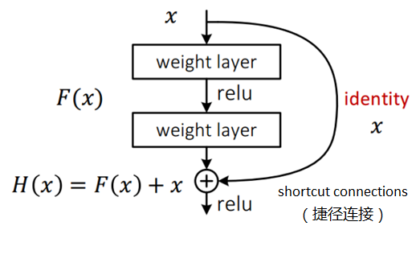

在本实验的实现中，图2残差块中weight layer将是有64个特征图输出、卷积核大小为3*3，步长为1的卷积层，并设置了Batch Normalization层，Relu激活函数也改为了PRelu。代码如下所示：
```python
class _IdentityBlock(tf.keras.Model):
    def __init__(self, filter, stride, data_format):
        super(_IdentityBlock, self).__init__(name='')

        bn_axis = 1 if data_format == 'channels_first' else 3

        self.conv2a = tf.keras.layers.Conv2D(
            filter, (3, 3), strides=stride, data_format=data_format, padding='same', use_bias=False)
        # self.bn2a = tf.keras.layers.BatchNormalization(axis=bn_axis)
        self.prelu2a = tf.keras.layers.PReLU(shared_axes=[1, 2])

        self.conv2b = tf.keras.layers.Conv2D(
            filter, (3, 3), strides=stride, data_format=data_format, padding='same', use_bias=False)
        # self.bn2b = tf.keras.layers.BatchNormalization(axis=bn_axis)

    def call(self, input_tensor):
        x = self.conv2a(input_tensor)
        # x = self.bn2a(x)

        x = self.prelu2a(x)
        x = self.conv2b(x)
        # x = self.bn2b(x)

        x = x + input_tensor
        return x

```

### 5.2 上采样 PixelShuffler
本实验的目标是将32x32的低分辨率图像超分辨率到128x128。因此模型无可避免需要做上采样的操作。在模型设计阶段，实验了包括了Conv2DTranspose方法，该方法是反卷积，即卷积操作的逆，但是实验结果发现该方法会造成非常明显的噪声像素；第二种上采样方法是TensorFlow UpSampling2D + Conv2D的方法，该方法是CNN中常见的max pooling的逆操作，实验结果发现该方法损失了较多的信息，实验效果不佳。本文最终选择了PixelShuffle作为上采样的方法。PixelShuffle操作如图3所示。输入为H*W的低分辨率图像，首先通过卷积操作得到r^2个特征图（r为上采样因子，即图像放大的倍数），其中特征图的大小与低分辨率图的大小一致，然后通过周期筛选（periodic shuffing）得到高分辨率的图像。

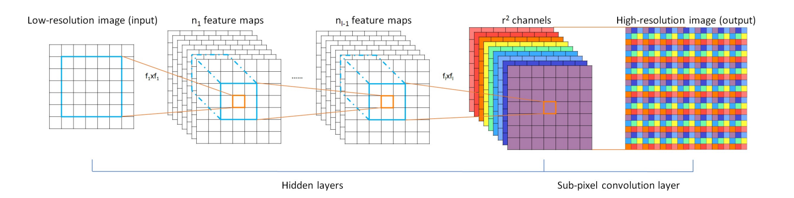

本实验将卷积部分的操作放到了GAN的生成器中，下面的代码展示了如何在r^2个特征图上做周期帅选得到目标高分辨率图像输出。
```python
def pixelShuffler(inputs, scale=2):
    size = tf.shape(inputs)
    batch_size = size[0]
    h = size[1]
    w = size[2]
    c = inputs.get_shape().as_list()[-1]

    # Get the target channel size
    channel_target = c // (scale * scale)
    channel_factor = c // channel_target

    shape_1 = [batch_size, h, w, channel_factor // scale, channel_factor // scale]
    shape_2 = [batch_size, h * scale, w * scale, 1]

    # Reshape and transpose for periodic shuffling for each channel
    input_split = tf.split(inputs, channel_target, axis=3)
    output = tf.concat([phaseShift(x, scale, shape_1, shape_2) for x in input_split], axis=3)

    return output

def phaseShift(inputs, scale, shape_1, shape_2):
    # Tackle the condition when the batch is None
    X = tf.reshape(inputs, shape_1)
    X = tf.transpose(X, [0, 1, 3, 2, 4])

    return tf.reshape(X, shape_2)


```

### 5.3 生成器
本实验使用的基本模型是GAN，在GAN的生成器部分将从低分辨率的输入产生高分辨率的模型输出。该部分的代码如下所示：
```python
class Generator(tf.keras.Model):
    def __init__(self, data_format='channels_last'):
        super(Generator, self).__init__(name='')

        if data_format == 'channels_first':
            self._input_shape = [-1, 3, 32, 32]
            self.bn_axis = 1
        else:
            assert data_format == 'channels_last'
            self._input_shape = [-1, 32, 32, 3]
            self.bn_axis = 3

        self.conv1 = tf.keras.layers.Conv2D(
            64, kernel_size=9, strides=1, padding='SAME', data_format=data_format)

        self.prelu1 = tf.keras.layers.PReLU(shared_axes=[1, 2])

        self.res_blocks = [_IdentityBlock(64, 1, data_format) for _ in range(16)]

        self.conv2 = tf.keras.layers.Conv2D(
            64, kernel_size=3, strides=1, padding='SAME', data_format=data_format)
    
        self.upconv1 = tf.keras.layers.Conv2D(
            256, kernel_size=3, strides=1, padding='SAME', data_format=data_format)
        self.prelu2 = tf.keras.layers.PReLU(shared_axes=[1, 2])

        self.upconv2 = tf.keras.layers.Conv2D(
            256, kernel_size=3, strides=1, padding='SAME', data_format=data_format)
        self.prelu3 = tf.keras.layers.PReLU(shared_axes=[1, 2])

        self.conv4 = tf.keras.layers.Conv2D(
            3, kernel_size=9, strides=1, padding='SAME', data_format=data_format)

    def call(self, inputs):
        x = tf.reshape(inputs, self._input_shape)

        x = self.conv1(x)
        x = self.prelu1(x)
        x_start = x

        for i in range(len(self.res_blocks)):
            x = self.res_blocks[i](x)

        x = self.conv2(x)
        x = x + x_start

        x = self.upconv1(x)
        x = pixelShuffler(x)
        x = self.prelu2(x)

        x = self.upconv2(x)
        x = pixelShuffler(x)
        x = self.prelu3(x)

        x = self.conv4(x)
        x = tf.nn.tanh(x)
        return x

```

### 5.4 判别器
本实验的GAN判别器的输入是一张128*128的图像，目标输出是一个布尔值，也就是判断输入的图像是真的图像还是通过模型为伪造的图像。本实验设计的生成器是由全卷积网络实现。判别器的代码如下所示：

```python
class Discriminator(tf.keras.Model):
    def __init__(self, data_format='channels_last'):
        super(Discriminator, self).__init__(name='')

        if data_format == 'channels_first':
            self._input_shape = [-1, 3, 128, 128]
            self.bn_axis = 1
        else:
            assert data_format == 'channels_last'
            self._input_shape = [-1, 128, 128, 3]
            self.bn_axis = 3

        self.conv1 = tf.keras.layers.Conv2D(
            64, kernel_size=3, strides=1, padding='SAME', data_format=data_format)

        self.conv2 = tf.keras.layers.Conv2D(
            64, kernel_size=3, strides=2, padding='SAME', data_format=data_format)
        # self.bn2 = tf.keras.layers.BatchNormalization(axis=self.bn_axis)

        self.conv3 = tf.keras.layers.Conv2D(
            128, kernel_size=3, strides=1, padding='SAME', data_format=data_format)
        # self.bn3 = tf.keras.layers.BatchNormalization(axis=self.bn_axis)

        self.conv4 = tf.keras.layers.Conv2D(
            128, kernel_size=3, strides=2, padding='SAME', data_format=data_format)
        # self.bn4 = tf.keras.layers.BatchNormalization(axis=self.bn_axis)

        self.conv5 = tf.keras.layers.Conv2D(
            256, kernel_size=3, strides=1, padding='SAME', data_format=data_format)
        # self.bn5 = tf.keras.layers.BatchNormalization(axis=self.bn_axis)

        self.conv6 = tf.keras.layers.Conv2D(
            256, kernel_size=3, strides=2, padding='SAME', data_format=data_format)
        # self.bn6 = tf.keras.layers.BatchNormalization(axis=self.bn_axis)

        self.conv7 = tf.keras.layers.Conv2D(
            512, kernel_size=3, strides=1, padding='SAME', data_format=data_format)
        # self.bn7 = tf.keras.layers.BatchNormalization(axis=self.bn_axis)

        self.conv8 = tf.keras.layers.Conv2D(
            512, kernel_size=3, strides=2, padding='SAME', data_format=data_format)
        # self.bn8 = tf.keras.layers.BatchNormalization(axis=self.bn_axis)

        self.fc1 = tf.keras.layers.Dense(1024)
        self.fc2 = tf.keras.layers.Dense(1)

    def call(self, inputs):
        x = tf.reshape(inputs, self._input_shape)
        x = self.conv1(x)
        x = tf.nn.leaky_relu(x)
        x = self.conv2(x)
        # x = self.bn2(x)
        x = tf.nn.leaky_relu(x)
        x = self.conv3(x)
        # x = self.bn3(x)
        x = tf.nn.leaky_relu(x)
        x = self.conv4(x)
        # x = self.bn4(x)
        x = tf.nn.leaky_relu(x)
        x = self.conv5(x)
        # x = self.bn5(x)
        x = tf.nn.leaky_relu(x)
        x = self.conv6(x)
        # x = self.bn6(x)
        x = tf.nn.leaky_relu(x)
        x = self.conv7(x)
        # x = self.bn7(x)
        x = tf.nn.leaky_relu(x)
        x = self.conv8(x)
        # x = self.bn8(x)
        x = tf.nn.leaky_relu(x)
        x = self.fc1(x)
        x = tf.nn.leaky_relu(x)
        x = self.fc2(x)
        return x

```

### 5.5 损失函数与优化器定义
常规的GAN中，生成器的损失函数为对抗损失，定义为生成让判别器无法区分的数据分布，即让判别器将生成器生成的图像判定为真实图像的概率尽可能的高。但是在超分辨率任务中，这样的损失定义很难帮助生成器去生成细节足够真实的图像。因此本实验为生成器添加了额外的内容损失。内容损失的定义有两种方式，一种是经典的均方误差损失，即对生成器生成的网络与真实图像直接求均方误差，这样方式可以得到很高的信噪比，但是图像在高频细节上有缺失。第二种内容损失的基础是预训练的VGG 19网络的ReLU激活层为基础的VGG loss，然后通过求生成图像和原始图像特征表示的欧氏距离来计算当前的内容损失。

本实验选择了VGG loss作为内容损失，最终的生成器损失定义为内容损失和对抗损失的加权和。本部分该部分代码如下所示，注意首先定义了用于计算内容损失的VGG 19网络：

```python
def vgg19():
    vgg19 = tf.keras.applications.vgg19.VGG19(include_top=False, weights='imagenet', input_shape=(128, 128, 3))
    vgg19.trainable = False
    for l in vgg19.layers:
        l.trainable = False
    loss_model = tf.keras.Model(inputs=vgg19.input, outputs=vgg19.get_layer('block5_conv4').output)
    loss_model.trainable = False
    return loss_model

def create_g_loss(d_output, g_output, labels, loss_model):
    gene_ce_loss = tf.losses.sigmoid_cross_entropy(tf.ones_like(d_output), d_output)

    vgg_loss = tf.keras.backend.mean(tf.keras.backend.square(loss_model(labels) - loss_model(g_output)))

    # mse_loss = tf.keras.backend.mean(tf.keras.backend.square(labels - g_output))

    g_loss = vgg_loss + 1e-3 * gene_ce_loss
    # g_loss = mse_loss + 1e-3 * gene_ce_loss
    return g_loss


```

本实验的判别器损失与传统的GAN判别器损失类似，目标是将生成器生成的伪造图像尽可能判定为假的，将真实的原始图像尽可能判断为真的。最终的判别器损失是两部分的损失之和。本部分代码如下所示：

```python
def create_d_loss(disc_real_output, disc_fake_output):
    disc_real_loss = tf.losses.sigmoid_cross_entropy(tf.ones_like(disc_real_output), disc_real_output)

    disc_fake_loss = tf.losses.sigmoid_cross_entropy(tf.zeros_like(disc_fake_output), disc_fake_output)

    disc_loss = tf.add(disc_real_loss, disc_fake_loss)
    return disc_loss

```

优化器选择的是Adam，beta 1设为0.9，beta 2设为0.999，epsilon设为1e-8，以减少震荡。代码如下所示：
```python
def create_optimizers():
    g_optimizer = tf.train.AdamOptimizer(learning_rate=1e-4, beta1=0.9, beta2=0.999, epsilon=1e-8)
    d_optimizer = tf.train.AdamOptimizer(learning_rate=1e-4, beta1=0.9, beta2=0.999, epsilon=1e-8)

    return g_optimizer, d_optimizer

```

### 5.6 训练过程
在上文中已经定义了实验的输入输出数据、生成器与判别器模型以及相应的优化器，本小节将介绍训练的过程。实验将首先导入上文的数据、模型与判别器，然后定义了checkpoint以持久化保存模型，然后一个批次一个批次地读取数据，进行每一步的训练。总体训练流程如下所示：

```python
def train(train_log_dir, train_image_ds, test_image_ds, epochs, checkpoint_dir):
    generator = isr_model.Generator()
    discriminator = isr_model.Discriminator()
    g_optimizer, d_optimizer = isr_model.create_optimizers()

    checkpoint_prefix = os.path.join(checkpoint_dir, "ckpt")
    checkpoint = tf.train.Checkpoint(g_optimizer=g_optimizer,
                                     d_optimizer=d_optimizer,
                                     generator=generator,
                                     discriminator=discriminator)
    loss_model = isr_util.vgg19()

    for epoch in range(epochs):
        all_g_cost = all_d_cost = 0

        step = 0

        it = iter(train_image_ds)
        while True:
            try:
                image_batch, label_batch = next(it)
                step = step + 1
                g_loss, d_loss = train_step(image_batch, label_batch, loss_model, generator, discriminator,
                                            g_optimizer, d_optimizer)
                all_g_cost = all_g_cost + g_loss
                all_d_cost = all_d_cost + d_loss
            except StopIteration:
                break

        generate_and_save_images(train_log_dir, generator, epoch + 1, test_image_ds)

        # saving (checkpoint) the model every 20 epochs
        if (epoch + 1) % 20 == 0:
            checkpoint.save(file_prefix=checkpoint_prefix)
```

在每一步的训练中，首先通过生成器获得伪造的高分辨率图像，然后分别计算生成器与判别器的损失，再分别更新生成器与判别器的参数，注意这里生成器与判别器的训练次数是1：1。代码如下所示：

```python
def train_step(feature, label, loss_model, generator, discriminator, g_optimizer, d_optimizer):
    with tf.GradientTape() as g_tape, tf.GradientTape() as d_tape:
        generated_images = generator(feature)

        real_output = discriminator(label)
        generated_output = discriminator(generated_images)

        g_loss = isr_model.create_g_loss(generated_output, generated_images, label, loss_model)
        d_loss = isr_model.create_d_loss(real_output, generated_output)

    gradients_of_generator = g_tape.gradient(g_loss, generator.variables)
    gradients_of_discriminator = d_tape.gradient(d_loss, discriminator.variables)

    g_optimizer.apply_gradients(zip(gradients_of_generator, generator.variables))
    d_optimizer.apply_gradients(zip(gradients_of_discriminator, discriminator.variables))

    return g_loss, d_loss

```

## 六、实验评估
本实验的评估部分将对比低分辨率图片、模型生成的高分辨率图片和原始图片的区别。本实验的训练数据有10656个图片，测试数据为5个图片。由于实验评估图像分辨率的提升效果，因此不需要按照一定比例划分训练集和测试集，而越多的训练数据也有更好的建模效果。但是需要注意的是，按照本实验现在的模型，需要的显存约为6.8G，如果增大批次数量、增加卷积层特征图数量、加深网络或增大原始图片分辨率，将进一步增加显存。

在本实验中，使用的是TensorFlow GPU版本，实验的GPU是NVIDIA GeForce GTX 1080，显存大小为8G。当前实验的各项超参数已经达到该显卡的最大可用显存。当前训练集一次迭代约需要7—8分钟，20次迭代的训练将持续约2.5小时。本实验前60次迭代的训练损失如图4所示。

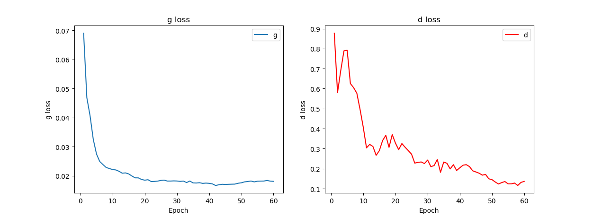

图4中生成器的损失在前20次迭代训练下降，20次迭代到60次迭代后在0.02上下波动，损失进一步下降变得缓慢；判别器的损失下降较为明显，但是注意到有多次震荡情况的出现。本实验继续增大迭代次数可能会有更好的损失表示。

表2显示了迭代42次和迭代60次后的模型在测试集上的表现对比。

|输入低分辨率图像|42次迭代后输出|60次迭代后输出|原始高分辨率图像|
|:---:|:---:|:---:|:---:|
|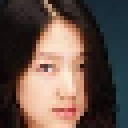|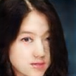|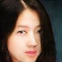||
|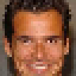|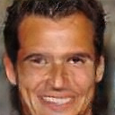|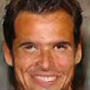||
||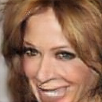|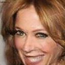||
|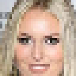|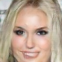|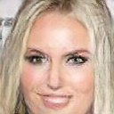|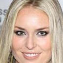|
||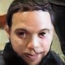|||

表1可见模型对分辨率有非常明显的提升，第一列低分辨率图像在放大后细节部分非常模糊，而第二列迭代42次于第三列迭代60次后，图像在一些细节部分例如头发、五官等有了更加清晰的轮廓。但是模型与原始图相比仍然还有差距，不能做到以假乱真。这一方面是因为实验只是在迭代60次后的模型上进行评估；一方面是因为原图是以JPG格式存储的，所以相比PNG无损格式的图片在细节上有先天的不足；还有原因是本实验将图片剪裁到了128*128，这是考虑到显存的权宜之计，更高的原始分辨率会有更丰富的细节信息。进一步增加迭代次数、进一步调整参数、扩大图片原始尺寸、使用原始PNG格式的图片等方法会导致最后的模型有更佳的效果。

## 七、总结
本实验以CV领域一个热门的话题—图像超分辨率作为主题，使用CelebA数据集作为实验数据，在一系列数据预处理的基础上，通过构建以GAN为基础的CNN、GAN和ResNet的混合模型作为超分辨率模型实现，在迭代训练60次后有非常明显的效果。但是限于GPU算力、训练时间等客观因素，模型的输出相比原图仍然不够完美，进一步的实验思路包括使用更好的机器、调大图像原始尺寸、使用原始PNG格式图像、增加迭代次数、进一步调参等相信能有更优秀的表现。另外GAN的训练非常困难，需要有耐心和一些技巧进行多次尝试。

---

# 注
详细案例请参考
- 赵卫东著. 机器学习案例实战. 北京：人民邮电出版社，2019（6月左右出版）


